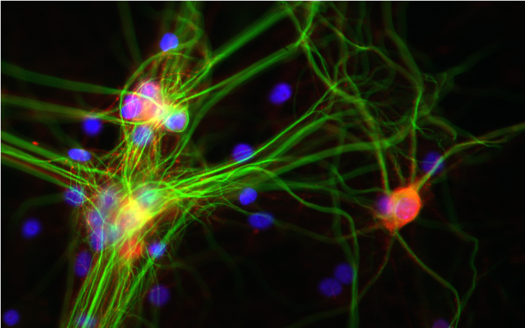
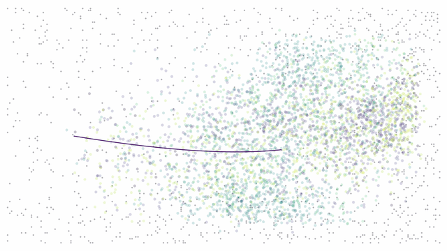
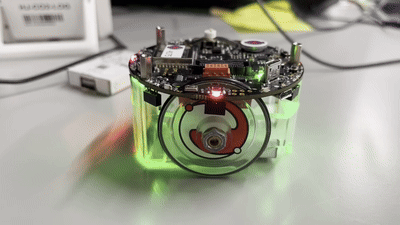

<div align="center">

# Hi there, I'm Kazushi Takehana.

### Neuroscience × Robotics × AI  
### Cultured Neurons / Embodiment / Adaptive Systems

<p>
  <a href="https://github.com/Ochagoro">
    
  </a>
  
  
  
</p>


</div>

<table align="center">
  <tr>
    <td valign="middle" align="center" width="30%">
      
    </td>
    <td valign="middle" align="center" width="32%">
      
    </td>
    <td valign="middle" align="center" width="32%">
      
    </td>
  </tr>
</table>

---

## About Me

I'm a PhD student at The University of Tokyo working at the intersection of:

- **Neuroscience**
- **Robotics**
- **Machine Learning / AI**
- **Embodiment & Adaptive Intelligence**

My current interests include:

- cultured neuronal networks and self-organization
- neuronal avalanches / criticality / burst dynamics
- closed-loop systems connecting biology and machines
- adaptive control and learning for embodied agents
- building tools that bridge **wet lab**, **computation**, and **robotics**

---

## Current Themes

```text
🧠 Cultured Neurons
   └─ spontaneous activity / burst structure / criticality / development

🤖 Embodied Intelligence
   └─ how physical interaction shapes adaptive behavior

📡 Closed-loop Neuro-Robotics
   └─ connecting neural dynamics to action and feedback

🛠 Research Infrastructure
   └─ HD-MEA analysis / perfusion systems / lab management tools
```

## Certifications

- **EIKEN, Grade 1**  
  実用英語技能検定1級  
  [Official Site](https://www.eiken.or.jp/eiken/en/)

- **Japan Statistical Society Certificate, Grade 1**  
  統計検定1級(理工学)  
  [Official Site](https://www.toukei-kentei.jp)

- **JDLA Deep Learning for GENERAL**  
  JDLA G検定  
  [Official Site](https://www.jdla.org)

- **Senior Virtual Reality Specialist**  
  バーチャルリアリティ技術者認定資格(セオリーコース・アプリケーションコース)  
  [Official Site](https://vrsj.org)

- **Waseda University Certification Program in Data Science, Advanced Level**  
  早稲田大学データ科学認定制度(上級)  
  [Official Site](https://www.waseda.jp/inst/cds/education/accreditation)

## Awards & Honors

- **Excellent Poster Award**  
  Joint Workshop of the Japanese Society for Artificial Intelligence, 2025  
  人工知能学会合同研究会2025にて受賞。  

- **Best Student Poster Award**  
  The 14th RIEC International Symposium on Brain Functions and Brain Computer  
  国際シンポジウムにおける学生ポスター発表賞。  
